:toc:
:toclevels: 2

= Reusable workflows and composite actions

This repository provides shared GitHub Actions workflows and composite actions for Rust and Node.js projects. Consumer repositories call these workflows from their own `check.yml` and `deploy.yml` files.

== Rust workflows

.Mermaid source
[%collapsible]
====
[source,mermaid]
----
flowchart TD
    subgraph orchestrator["rust-run-checks.yml (orchestrator)"]
        direction TB
        RB["Build\n(rust-build.yml)"]
        RL["Linting\n(rust-lint.yml)"]
        RF["Formatting\n(rust-formatting.yml)"]
        RT["Tests\n(rust-test.yml)"]
        RC["Coverage\n(rust-coverage.yml)\nif: enabled"]
    end

    subgraph build["rust-build.yml"]
        direction TB
        S1["cargo-setup"] --> S2["just build"]
        S2 --> S3["just deb"]
        S3 --> S4["sha256sum → checksums"]
        S4 --> S5["Upload artifacts\n→ artifact-id"]
    end

    subgraph release["rust-gh-release.yml"]
        direction TB
        R1["Download artifact"] --> R2["GitHub Release (draft)\n*.deb + checksums"]
    end

    subgraph actions["cargo-setup (composite action)\ncheckout + cache + toolchain + just"]
    end

    RB --> build
    orchestrator -.->|"artifact-id"| release

    build -.-> actions
    RL -.-> actions
    RF -.-> actions
    RT -.-> actions
    RC -.-> actions
----
====

=== Workflow summary

rust-run-checks.yml (orchestrator)::
Composes all Rust check workflows and runs them in parallel. Accepts an optional `coverage` flag and `container-image` input. Outputs `artifact-id` from the build job. Uses concurrency control (`checks-<ref>`, cancel-in-progress).

rust-build.yml::
Builds the project with `just build`, generates a `.deb` package with `just deb`, creates SHA256 checksums, and uploads all artifacts. Outputs `artifact-id`.

rust-lint.yml::
Runs `just clippy` for linting.

rust-formatting.yml::
Runs `just fmt-check` to verify code formatting.

rust-test.yml::
Runs `just test` for the test suite.

rust-coverage.yml::
Runs `just coverage` for test coverage reporting. Skips when `enabled` is `false`. Installs `cargo-tarpaulin` on bare runners.

rust-gh-release.yml::
Downloads build artifacts by ID and creates a draft GitHub release with `.deb` packages and checksums. Only creates a release on tag pushes.

=== Composite action: cargo-setup

Checks out the repository, resolves `CARGO_HOME`, caches Cargo dependencies, and (on bare runners) installs a stable Rust toolchain with clippy and rustfmt, plus `just`.

== Node.js workflows

.Mermaid source
[%collapsible]
====
[source,mermaid]
----
flowchart TD
    subgraph orchestrator["node-run-checks.yml (orchestrator)"]
        direction TB
        NB["Build\n(node-build.yml)"]
        NL["Linting\n(node-lint.yml)"]
        NF["Formatting\n(node-formatting.yml)"]
        NT["Tests\n(node-test.yml)"]
    end

    subgraph build["node-build.yml"]
        direction TB
        S1["node-setup"] --> S2["pnpm build"]
        S2 --> S3["pnpm pack"]
        S3 --> S4["sha256sum → checksums"]
        S4 --> S5["Upload artifacts\n→ artifact-id"]
    end

    subgraph release["node-gh-release.yml"]
        direction TB
        R1["Download artifact"] --> R2["GitHub Release (draft)\n*.tgz + checksums"]
    end

    subgraph actions["node-setup (composite action)\ncheckout + pnpm + node"]
    end

    NB --> build
    orchestrator -.->|"artifact-id"| release

    build -.-> actions
    NL -.-> actions
    NF -.-> actions
    NT -.-> actions
----
====

=== Workflow summary

node-run-checks.yml (orchestrator)::
Composes all Node.js check workflows and runs them in parallel. Requires `node-version` and `pnpm-version` inputs. Outputs `artifact-id` from the build job. Uses concurrency control (`checks-<ref>`, cancel-in-progress).

node-build.yml::
Builds the project with `pnpm build`, packs with `pnpm pack`, creates SHA256 checksums, and uploads all artifacts. Outputs `artifact-id`.

node-lint.yml::
Runs `pnpm lint` for linting.

node-formatting.yml::
Runs `pnpm format:check` to verify code formatting.

node-test.yml::
Runs `pnpm test:coverage` for the test suite with coverage.

node-gh-release.yml::
Downloads build artifacts by ID and creates a draft GitHub release with `.tgz` packages and checksums. Only creates a release on tag pushes.

=== Composite action: node-setup

Checks out the repository, installs pnpm, sets up Node.js with pnpm caching, and runs `pnpm install --frozen-lockfile`.

== Usage

Consumer repositories reference these workflows with `workflow_call`:

[source,yaml]
----
jobs:
  Checks:
    uses: tylerkelly13/.github/.github/workflows/rust-run-checks.yml@main
    with:
      coverage: true
----

See the https://docs.github.com/en/actions/sharing-automations/reusing-workflows[GitHub documentation on reusable workflows] for more details.
